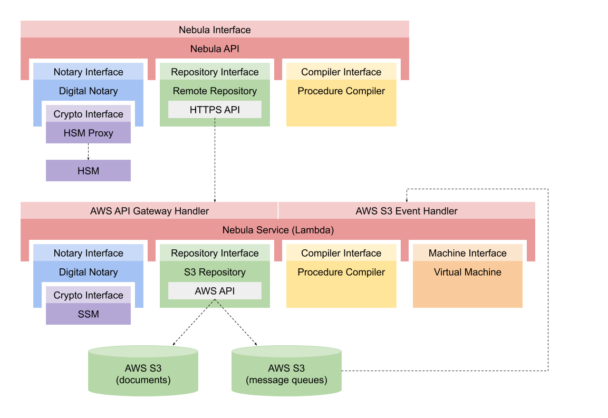

### Bali Nebula™ API
This project provides a JavaScript version of the API needed to interact with the _Bali Nebula™_. It allows a client program to perform the following tasks:
 * create components and commit them to the Bali Nebula™ document repository as notarized documents
 * compile component type documents to create new types in the repository
 * send messages to components that are stored as notarized documents in the repository
 * send and receive notarized messages over global queues
 * post notarized events to other interested components



_**WARNING**_
_This project is still in its early stages and the classes and interfaces to the classes are likely to change._

### Quick Links
For more information on this project click on the following links:
 * [wiki](https://github.com/craterdog-bali/js-bali-nebula-api/wiki)
 * [node package](https://www.npmjs.com/package/bali-nebula-api)
 * [release notes](https://github.com/craterdog-bali/js-bali-nebula-api/wiki/release-notes)
 * [project documentation](https://github.com/craterdog-bali/bali-project-documentation/wiki)

### Getting Started
To install this NodeJS package, execute the following command:
```
npm install bali-nebula-api
```
Then add the following line to your NodeJS modules:
```
const nebula = require('bali-nebula-api');
```

Check out the example code [here](https://github.com/craterdog-bali/js-bali-nebula-api/wiki/code-examples).

### Contributing
Project contributors are always welcome. Create a [fork](https://github.com/craterdog-bali/js-bali-nebula-api) of the project and add cool new things to the framework. When you are ready to contribute the changes create a subsequent ["pull request"](https://help.github.com/articles/about-pull-requests/). Any questions and comments can be sent to craterdog@gmail.com.
